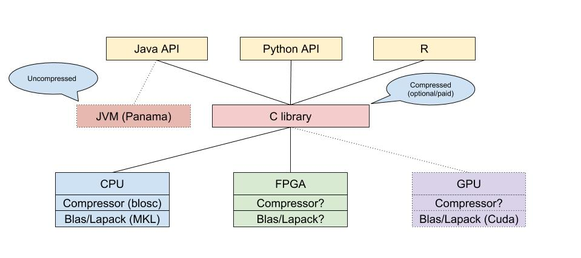

# IronTensor

This is a working document to brainstorm and define: scope, features and priorities of the project.

**Executive goal: Save money on infrastructure by increasing efficiency (less Hardware, more performance)** 

Goal of the project is to develop a math library written in C that operates on **compressed** data-structures. With the following feature-set:

* High-level API's
	* Java
		* Vectorized Streams?
	* Python
	* R (later)
	* ...
* Math Operations/Features:
	* Focus on traditional linear algebra 
	* BLAS/LAPACK
	* FFT
	* Distributions / Random-Numbers
* Data-Structure: 
	* Vector
	* Matrix
	* N-dimensional array (Tensor)
* Data-Compression:
	* Loss-less compression (leverage c-blosc2 for CPU)
	* Auto-tuning tools to select the right compression algorithm and level for the problem
	* Lossy compression (for random-data); operate on compressed data (e.g. based on Vector quantization)
	* Uncompressed in-memory (leverage Intel MKL, CUDA, OpenCL etc.)
* Custom operators on data-structures
	* Possibility to define custom operators (C based)
	* Offer auto-tuning tools (blocking, tiling etc.)
* Heterogeneous Hardware-Support
	* CPU
	* GPU
	* FGPA 
* Persistence
	* Optionally persistent (e.g. via mmap / lmdb.. nvram.. persistent memory)

## Use-Cases

Due to the fact that everybody worries about machine-learning and artificial intelligence that space is 
very crowded. Therefore I'd like to start with more traditional use-cases.

1. Linear algebra
2. Monte-carlo simulations
3. ...

However, linear algebra is as well at the core of machine-learning etc.. 
so in the future that could be an option too.

My client-base is the financial industry (banking, insurance) so I'll try to come-up with full use-cases and example data from that domain.

## Approach

Following the iterative approach how I would develop the project.

### Benchmark / Performance test-suite

First, create a benchmark / performance test-suite for the use-cases we want to support.
Benchmark against competitors. Define and manage competitors.

### Develop API

Todo

### Develop CPU backend

Todo

## Priorities and Outlook

1. Create a minimum viable project, that supports: 
	- Compression
	- Vector, Matrix, Cube data-types
	- BLAS and basic operators

Rest to be defined.

## Input and Links:

* https://github.com/Blosc
* https://github.com/dblalock/bolt
* https://github.com/astojanov/Clover
* https://arxiv.org/pdf/1706.10283
* http://bitmagic.io/sparse-vector-search.html?cn=ZmxleGlibGVfcmVjcw%3D%3D&refsrc=email
* https://www.anandtech.com/show/13047/ngd-launches-catalina-2-programmable-ssds

